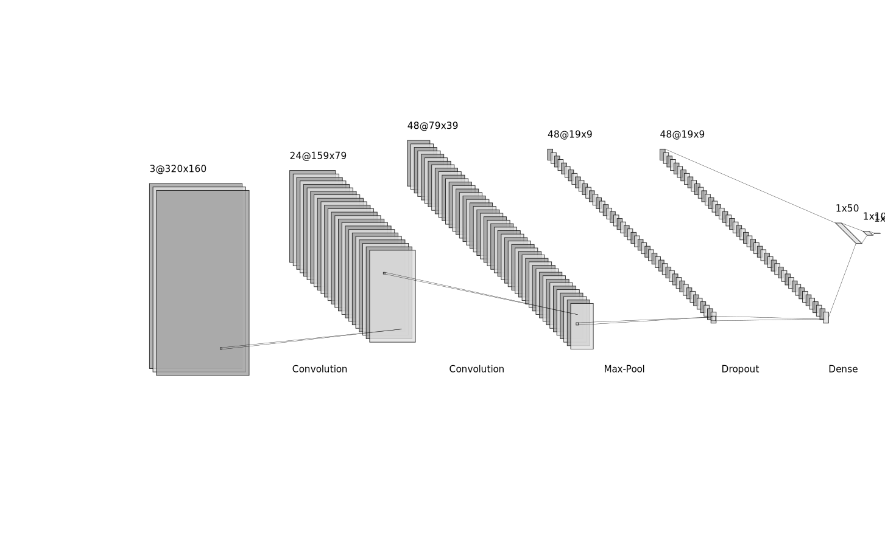

# Self Drving

## Introduction

Self driving is a machine learning project involving training a Deep Neural Network in pytorch to predict the steering radius of a self driving vehicle with the front camera capture as the input. The trained network is then used to drive a simulation vehicle powered by [Udacity's Self Driving Simulator]('https://github.com/udacity/self-driving-car-sim'). The end result is a simulated vehicle that can drive itself through a trained track

## Training Data

The training data comprised of around 5400+ images taken from the front-center, front-left and front-right cameras of the simulator. These images are also taken using the [Udacity's Self Driving Simulator]('https://github.com/udacity/self-driving-car-sim'). The front-left and front-right images are adjusted such that their prediction labels are corrected to match wih the front-center. In order to avoid overfitting the camera images are randomly flipped horizontally so that even if the turns are more in one particular direction in the training data, it will not cause overfitting

## The self driving Net

Self Driving Net is the neural net powering a simulated driving vehicle. The depiction of the network is as shown below:

As in the diagram above the network contains 8 layers taking as an input 3 layers reoresenting the RGB Channel of the image taken from the front camera of the vehicle. The final dense layer will predict the radius in degrees to which the steering needs to be rotated in order to keep the vehicle on track

## Training

Since the model is used to predict the approximate value of the steering radius the Criterion used for calculating the loss is `Mean Squared Error (MSE)` Loss. The Optimizer model uses to to train is a version of Gradient Descent algorithm called `Adam Optimizer`. The network was performing fairly when trained for an epoch ranging from 20 - 30. This range depends on the data used for training. 
The state dictionary associated with the network is then stored for later use.

